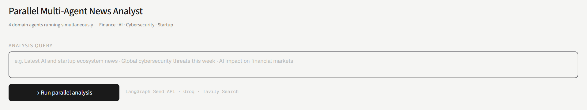
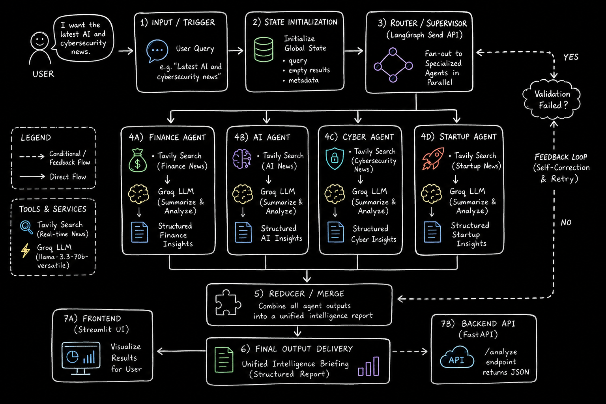

# Parallel Multi-Agent News Analyst

[](https://www.python.org/)
[](https://langchain-ai.github.io/langgraph/)
[](https://groq.com/)
[](https://streamlit.io/)
[](LICENSE)
 

*Lightweight multi-agent news analysis using LangGraph (orchestration), Groq (LLM), and Tavily (news search). FastAPI provides an API and Streamlit a simple UI.*



## Architecture
 
*Four specialized agents (Finance, AI, Cyber, Startup) run in parallel using LangGraph's `Send` API. Each agent queries Tavily for news and summarizes results with Groq (`llama-3.3-70b-versatile`, `temperature=0`). A reducer merges outputs into a single `final_report`.*



Requirements
- Python 3.10+
- `GROQ_API_KEY`, `TAVILY_API_KEY` in a `.env` file

Clone
```bash
git clone https://github.com/ARUNAGIRINATHAN-K/parallel-news-analyst.git
cd parallel-news-analyst
```

Quick setup (Windows PowerShell)
```powershell
python -m venv venv
.\venv\Scripts\Activate.ps1
pip install -r requirements.txt
```

Configure environment (create `.env` from `env.example`)
```
GROQ_API_KEY=your_groq_api_key
TAVILY_API_KEY=your_tavily_api_key
```

Run
- Start both services: `.\run.ps1`
- Or start individually:
  - Backend: `python -m uvicorn api.main:app --reload`
  - Frontend: `streamlit run ui/streamlit_app.py`

API Endpoints
- `GET /` health/info
- `GET /health` simple health check
- `POST /analyze` JSON body `{ "query": "..." }` returns aggregated analysis

## API
 
**POST /analyze**
```json
// Request
{ "query": "Latest AI and cybersecurity news" }
 
// Response
{
  "success": true,
  "query": "...",
  "final_report": "...",
  "finance_results": [],
  "ai_results": [],
  "cyber_results": [],
  "startup_results": []
}
```

Minimal file map
- `api/main.py` — FastAPI backend
- `ui/streamlit_app.py` — Streamlit UI
- `graph/` — LangGraph workflow and state
- `agents/` — domain agents
- `tools/` — Tavily & Groq helpers

License
This project is MIT licensed — see `LICENSE`.
