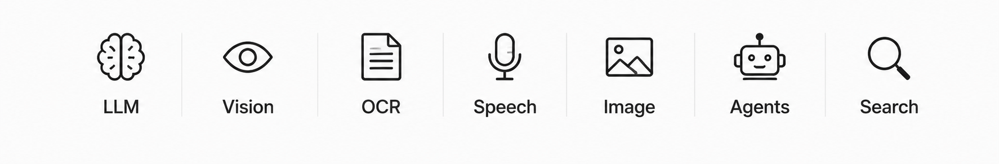

## *All projects are built using completely free & accessible AI APIs*

## ✨Featured Projects

| Project | Description | Tech Stack | Status |
| --- | --- | --- | --- |
| **[AI YouTube Video Chaptering](AI_YouTube_Video_Chaptering)** | AI Video Chaptering using Python | Python, NLP, YouTube API | ✅ Active |
| **[AI YouTube video Summarizer](AI_YouTube_Video_Summarizer)** | AI System to Summarize YouTube Videos into Notes | Python, NLP, YouTube API | ✅ Active |
| **[Fine-Tuning Qwen3-4B with Unsloth](Fine-Tuning_Qwen3-4B_with_Unsloth)** | End-to-End LLM Fine-Tuning & Distillation | Python, Hugging Face, Groq API | ✅ Active |
| **[Parallel Multiagent news Analyst](Parallel_Multiagent_news_Analyst)** | Multi-agent news analysis pipeline. | Python, LangGraph, Groq API | ✅ Active |
| **[Spotify Recommendation Engine](Spotify_Recommendation_Engine)** | Music Recommendation System using Python | Python, Spotipy API| ✅ Active |
| **[ML Model REST API](ML_Model_REST_API)** | Deploy Your First ML Model as a REST API | Python, FastAPI, RandomForest | ✅ Active |
| **[Dockerized ML Deployment](Dockerized_ML_Deployment)** | Deploy a Machine Learning Model with Docker | Docker, FastAPI, Python | ⏳ Planned |
| **[Production LLM API]()** | FastAPI production LLM serving TinyLlama. | Python, FastAPI, TinyLlama | ⏳ Planned |
| **[GitHub AI Code Reviewer]()** | AI Code Review Bot for GitHub automated private PR reviews. | Python, GitHub API, LLM API | ⏳ Planned |
| **[Fine-Tuned Code Generator]()** | Build a Python LLM-based code generator. | Python, Hugging Face, GitHub API | ⏳ Planned |
| **[Gemini Multi-Agent System]()** | Multi-Agent System using Gemini API | Python, Gemini API, LangGraph / CrewAI | ⏳ Planned |
| **[LLM MCP Server]()** | LLM to MCP server connect models to tools. | Python, FastMCP, Ollama | ⏳ Planned |

